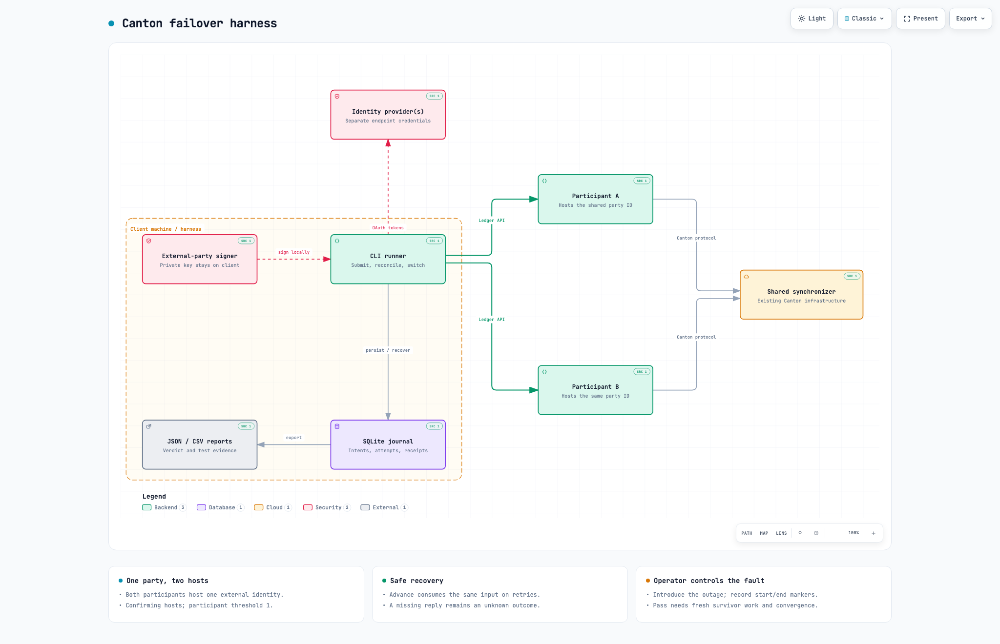

# Canton failover harness

Test whether your Canton workload can keep making progress when one of two participants hosting **the same external party ID** becomes unavailable.

This CLI is for operators testing a dual-participant setup. It runs a signed test workload, switches participants when needed, and produces evidence of what happened during the outage and after recovery. Start with the credential-free local demo, then configure it for your own participants.

## What it tests

- **Continued progress:** can the surviving participant submit and confirm new operations while the other is unavailable?
- **Recovery time:** does the first qualifying survivor confirmation arrive within the limit you configured?
- **Safe retries:** uncertain submissions are reconciled against ledger receipts before the workload advances. Retries preserve the operation identity and input contract.
- **Agreement after recovery:** do both participants report the expected receipt chain and final state?

Live runs save a resumable SQLite journal and JSON/CSV reports with submission attempts, failover events, outage markers, and a pass, fail, or inconclusive result. A failover pass requires fresh survivor operations during the marked outage and agreement from both participants afterward.

You prepare the shared-party topology and introduce and restore infrastructure faults. The harness drives the test workload and evaluates the evidence; it is not a production failover service or a throughput benchmark.

## Try it

Requires **Node.js 24.10 or newer**.

```sh
git clone https://github.com/cbolden15/canton-failover-harness.git
cd canton-failover-harness
npm ci
npm start
```

Choose **Try the local demo**. It needs no credentials, validators, or Daml SDK. A successful demo reports `SIMULATION_FAILOVER_PASS` and saves JSON/CSV results under `runs/`. Simulation does not validate your live network.

## Watch traffic fail over

Start the lightweight local browser UI from a source checkout:

```sh
npm run ui
```

Open `http://127.0.0.1:8787` and click **Start simulation**. The real harness runs against the local protocol simulator, marks an outage on A, and continues through B. The page shows selected routes, receipt confirmations, unresolved operations, and a traffic timeline. Every demo is labelled simulation and saves its journal and reports under `runs/`.

To watch an existing live run without modifying it:

```sh
npm run ui -- --journal /absolute/path/to/journal.sqlite
```

The viewer displays both participant IDs and the shared external party ID, and polls the journal every 400 ms. New runs retain these IDs in their journal. Older live journals use their saved config when it still matches the run; otherwise IDs display as unavailable. Run the workload and manage live faults through the existing CLI and operator procedure. Use `--port 8788` if the default port is occupied. Stop the viewer with Ctrl+C.

### Test without stopping infrastructure

Click **Try proxy controls** in the local UI to run a simulation through a real loopback forwarding proxy. Click **Block traffic to A**, wait for the fresh survivor confirmation requirement, and click **Restore traffic to A**. This manual exercise submits 60 operations at one-second intervals. Restore before the two-minute convergence deadline if the workload finishes while A is blocked.

For live participants, first initialize a journal against your prepared failover config. Start the proxy UI with that same config and journal, then run the CLI through the proxy-generated config. The UI can disconnect and restore the configured fault endpoint. See the [proxy exercise procedure](docs/running-tests.md#client-proxy-exercise).

The proxy cuts existing connections and blocks new connections to the selected route. It affects only this harness's Ledger API traffic; both participants remain online. Reports label this evidence `CLIENT_PROXY_FAILOVER_PASS` (or `SIMULATION_CLIENT_PROXY_FAILOVER_PASS`) and identify the fault source. Connection cuts can leave a submitted transaction's outcome unknown; receipt reconciliation still determines whether it committed.

## Test your participants

First, follow the [live-test guide](docs/running-tests.md#connect-your-participants) to prepare the shared party, permissions, receipt DAR, and credentials. Then configure a profile:

```sh
npm start -- setup --env-file .env
npm start -- doctor --profile testnet --env-file .env
npm start -- start --profile testnet --env-file .env
```

Use the profile name you chose. Environment files load only with `--env-file`; omit it when credentials are already in your environment. Start with a healthy baseline, then follow the [outage and recovery procedure](docs/running-tests.md#run-and-recover).

**Keep your journal.** Resume interrupted or uncertain runs with the same journal; never create another root to clear an error.

## How it works

The CLI runs on your laptop or a separate machine. It signs locally, records each operation in a SQLite journal, and sends transactions through either participant. A consuming receipt contract guards against duplicate state transitions when an operation is retried.

[](https://cbolden15.github.io/canton-failover-harness/)

[Explore the interactive diagram](https://cbolden15.github.io/canton-failover-harness/)

## Documentation

| Need | Guide |
| --- | --- |
| Understand the components | [Architecture](docs/diagrams/README.md) |
| Prepare and run a live test | [Setup, outage markers, recovery, and results](docs/running-tests.md) |
| Configure party hosting and access | [External-party setup](docs/external-party-setup.md) · [Authentication](docs/authentication.md) |
| Diagnose unexpected behavior | [Known issues](docs/gotchas.md) · [Engineering notes](docs/engineering.md) |
| Build, package, or contribute | [Development](docs/development.md) · [Contracts](contracts/README.md) · [Verification](docs/verification.md) |
